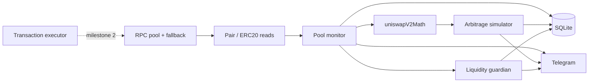

# wPKN Liquidity Guardian

BNB Smart Chain service that watches Uniswap V2–style pools for **wPKN**, tracks reserves and implied prices, simulates two-pool arbitrage after fees/gas, and plans liquidity refills under hard spending caps. **v0.1 ships monitoring only** — swaps and `addLiquidity` stay behind feature flags and are not wired to mainnet yet.


## Why it exists

Single-token liquidity on two DEX pools drifts: reserves drop, prices diverge, and naive bots burn gas or treasury funds. This project treats **observability and simulation first**, then optional execution with a dedicated hot wallet, daily limits, and gas ceilings.

## Stack

| Layer | Choice |
|--------|--------|
| Runtime | Node 20+, ESM TypeScript |
| Chain | ethers v6, direct pair `getReserves()` (no indexer) |
| Math | Pure `bigint` Uniswap V2 (`getAmountOut` / two-pool arb) |
| State | SQLite (WAL), reserve snapshots + alert history |
| Alerts | Telegram Bot API |
| Ops | Docker multi-arch, health HTTP, Oracle Cloud–oriented compose limits |

## Architecture



## Technical highlights

- **Correct reserve mapping** — reads `token0` / `token1` from the pair; never assumes wPKN is `token0`.
- **Executable price model** — reserve ratio plus constant-product output (25/30 bps fee configurable per pool).
- **Safety defaults** — `DRY_RUN=true`, `ENABLE_TRADING=false`, `ENABLE_AUTO_LIQUIDITY=false`; startup rejects treasury wallet reuse when `TREASURY_ADDRESSES` is set.
- **Spending guardrails** — per-tx and per-day wPKN/WBNB caps, `MAX_GAS_PRICE_GWEI`, cooldown between actions (enforced in planner; on-chain path stubbed in v0.1).
- **Low VPS footprint** — 30s poll interval, single RPC batch, compose memory cap 512M, ARM64 image.

## Repo layout

```
src/blockchain/   provider fallback, pair reads, gas checks
src/dex/          bigint AMM math
src/services/     monitor, arb sim, liquidity planner, telegram
src/db/           schema + snapshots / daily usage
```

Module boundaries for parallel work: [AGENTS.md](./AGENTS.md). Threat model: [SECURITY.md](./SECURITY.md).

## Status

| Milestone | State |
|-----------|--------|
| Read-only monitoring + dry-run loop | Done |
| Math unit tests (Vitest) | 8 tests |
| Docker + systemd + deploy doc | Done |
| Live swap / addLiquidity | Not implemented |

## Quick start

```bash
cp .env.example .env   # WPKN_ADDRESS, POOL_A_ADDRESS, RPC_URLS
npm install
npm run dev              # logs reserves, prices, sim arb, refill plan each tick
npm test                 # Uniswap V2 math
```

Production build: `npm run build && npm start` · Health: `GET http://localhost:8080/health`

## Deploy

Oracle Cloud Ubuntu (Ampere), Docker Compose, logs, updates: **[docs/DEPLOY.md](./docs/DEPLOY.md)**

## Configuration (summary)

| Variable | Default | Role |
|----------|---------|------|
| `DRY_RUN` | `true` | Blocks transactions |
| `ENABLE_TRADING` | `false` | Swaps (future) |
| `ENABLE_AUTO_LIQUIDITY` | `false` | Refills (future) |
| `MIN_WPKN_RESERVE_PER_POOL` | `50` | Low-liquidity alert |
| `PRICE_DIFF_ALERT_PERCENT` | `10` | Cross-pool alert |
| `MAX_GAS_PRICE_GWEI` | `3` | Skip high-gas periods |

Full list: [.env.example](./.env.example)

## Scripts

`npm run dev` · `npm run build` · `npm start` · `npm test` · `npm run lint` (typecheck)

---

**Note:** Enabling auto-execution can lose funds. Use an isolated bot wallet only. See [SECURITY.md](./SECURITY.md).
